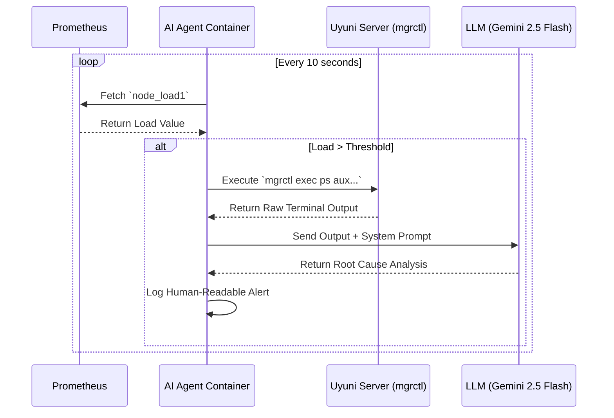

# Uyuni AI Agent - Proof of Concept (PoC)

This repository contains the standalone Python Proof of Concept for the **GSoC 2026: AI-Powered Intelligent Monitoring and Root Cause Analysis for Uyuni** proposal.

## Architecture & Security Alignment

As discussed with the Uyuni maintainers, to maintain strict security boundaries and isolation, this AI Agent runs as an **independent, standalone container** rather than inside the Uyuni server container.

Instead of relying on internal server tools (like Salt-API/CherryPy), it securely orchestrates targeted system inspections from the outside by wrapping the official **mgrctl exec** CLI utility and standard SSH commands. Raw diagnostic output is then sent to an LLM for automated Root Cause Analysis.

## Workflow Diagram



## Features

- **Prometheus Ingestion:** Queries the Prometheus HTTP API (e.g., `node_load1`).
- **Threshold Evaluation:** Evaluates anomalies based on configurable thresholds.
- **mgrctl Orchestration:** Upon anomaly detection, dynamically executes Salt commands on the affected minions (e.g., fetching top CPU-consuming processes) using `mgrctl exec`.
- **AI Root Cause Analysis:** Sends raw diagnostic output to Gemini 2.5 Flash with a SUSE sysadmin system prompt. Returns a structured RCA identifying the responsible process, root cause, and concrete remediation steps. Falls back gracefully to raw output if no API key is configured.
- **Enterprise-ready Code:** Fully typed (`typing`), modularized, structured with standard logging, and covered by pytest unit tests.
- **Secure by Default:** Utilises the official **openSUSE BCI** (Base Container Image) for Python 3.11 to ensure a minimal, secure, and vulnerability-free footprint. The LLM API key is never hardcoded and is redacted from error logs.

## Running the PoC

### Local Execution (Simulation Mode)

If `mgrctl` is not present on your system, the agent will gracefully fall back to returning simulated data for demonstration purposes. `LLM_API_KEY` is optional — without it, AI analysis is skipped and raw output is logged instead.

```bash
pip install -r requirements.txt
export LLM_API_KEY="your_gemini_api_key"   # optional
python main.py
```

Get a free Gemini API key at [aistudio.google.com/apikey](https://aistudio.google.com/apikey).

### Running the Test Suite

```bash
pytest tests/ -v
```

All external calls (Prometheus, mgrctl, Gemini API) are mocked — no real services or API keys are needed.

## Docker Deployment

Build the image:

```bash
docker build -t uyuni-ai-agent-poc .
```

Run the container:

```bash
docker run \
  -e PROMETHEUS_URL="http://your-prom:9090" \
  -e MINION_ID="myminion.mgr.suse.de" \
  -e THRESHOLD="2.0" \
  -e LLM_API_KEY="your_gemini_api_key" \
  uyuni-ai-agent-poc
```
