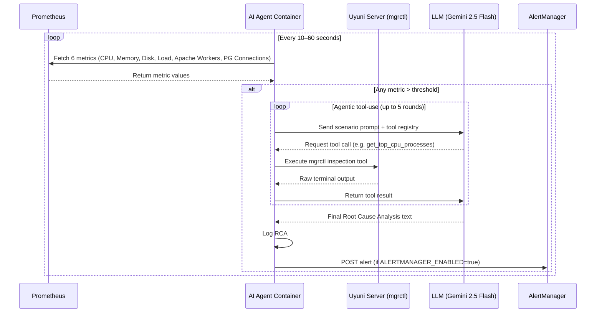

# Uyuni AI Agent - Proof of Concept (PoC)

This repository contains the standalone Python Proof of Concept for the **GSoC 2026: AI-Powered Intelligent Monitoring and Root Cause Analysis for Uyuni** proposal.

## Architecture & Security Alignment

As discussed with the Uyuni maintainers, to maintain strict security boundaries and isolation, this AI Agent runs as an **independent, standalone container** rather than inside the Uyuni server container.

Instead of relying on internal server tools (like Salt-API/CherryPy), it securely orchestrates targeted system inspections from the outside by wrapping the official **mgrctl exec** CLI utility and standard SSH commands. Raw diagnostic output is then sent to an LLM for automated Root Cause Analysis.

## Workflow Diagram



## Features

- **Multi-Metric Prometheus Monitoring:** Queries CPU usage, memory usage, disk usage, node load, Apache busy workers, and PostgreSQL active connections via PromQL — 6 metrics with per-metric configurable thresholds.
- **Threshold Evaluation:** Detects anomalies across all 6 metrics with severity grading (alert / warning / critical) based on how far a value exceeds its threshold.
- **Agentic Tool-Use Loop:** Uses Gemini native function calling to drive an autonomous investigation loop (up to 5 rounds). Gemini decides which inspection tool to call next based on the evidence gathered so far.
- **mgrctl Inspection Toolkit:** 8 diagnostic tools available to the agent, executed via `mgrctl exec` on the monitored minion:
  - Top CPU-consuming processes
  - Top memory-consuming processes
  - Disk usage breakdown (`df` + `du`)
  - Running systemd services
  - Service journal logs (with input sanitization to prevent command injection)
  - Apache error log tail
  - PostgreSQL slow query listing (`pg_stat_activity`)
- **Scenario-Specific AI Analysis:** Sends raw diagnostic output to Gemini 2.5 Flash with a SUSE sysadmin system prompt and scenario-aware templates (high CPU, high memory, disk full, high Apache load, high PostgreSQL connections). Returns a structured RCA identifying the responsible process, root cause, and concrete remediation steps. Falls back gracefully to raw output if no API key is configured.
- **AlertManager Integration:** Optionally POSTs structured alerts to AlertManager (`ALERTMANAGER_ENABLED=true`). Each alert carries severity labels and the full RCA text as the description annotation.
- **Simulation Mode:** When `mgrctl` is not available (dev/CI), all inspection tools return realistic simulated terminal output so the full pipeline can be demonstrated without a live Uyuni server.
- **Secure by Default:** Uses the official **openSUSE BCI** (Base Container Image) for Python 3.11. The LLM API key is never hardcoded and is redacted from error logs. Service name inputs are validated against an allowlist pattern to prevent injection.
- **Comprehensive Test Suite:** 115 unit tests across 9 test files — all external calls (Prometheus, mgrctl, Gemini API, AlertManager) are mocked. No real services or API keys needed.

## Project Structure

```text
uyuni-ai-agent-poc/
├── agent/
│   ├── core.py              # UyuniAIAgent class — legacy orchestrator
│   ├── ai_agent.py          # Agentic tool-use loop (Gemini function calling, ≤5 rounds)
│   ├── metrics.py           # Prometheus query functions (CPU, memory, disk, load, Apache, Postgres)
│   ├── tools.py             # 8 mgrctl inspection tools with simulated fallback
│   ├── evaluator.py         # Multi-metric threshold evaluation engine (6 metrics, per-metric env overrides)
│   ├── alerting.py          # AlertManager integration (build_alert, send_to_alertmanager)
│   └── prompts/
│       ├── __init__.py              # load_prompt() and build_prompt() helpers
│       ├── system_prompt.md         # Base SUSE sysadmin persona for Gemini
│       ├── high_cpu.md              # Scenario template for CPU anomalies
│       ├── high_memory.md           # Scenario template for memory anomalies
│       ├── disk_full.md             # Scenario template for disk anomalies
│       ├── high_apache_load.md      # Scenario template for Apache worker saturation
│       └── postgres_connections.md  # Scenario template for PostgreSQL connection spikes
├── tests/
│   ├── test_core.py          # Agent delegation and LLM integration tests
│   ├── test_ai_agent.py      # Agentic loop tests (tool calls, fallback, multi-round)
│   ├── test_metrics.py       # Prometheus query tests (mocked HTTP)
│   ├── test_tools.py         # Inspection tools tests (mocked subprocess)
│   ├── test_evaluator.py     # Threshold evaluation and severity tests
│   ├── test_alerting.py      # AlertManager build_alert and send tests
│   ├── test_prompts.py       # Prompt loading and template interpolation tests
│   └── test_integration.py   # Full pipeline tests (evaluate → investigate → alert)
├── main.py                   # Entry point — reads env vars, runs monitoring loop
├── Dockerfile                # Production container (openSUSE BCI Python 3.11)
├── requirements.txt          # requests==2.31.0, pytest==8.0.0
├── .env.example              # Environment variable reference
└── .github/workflows/ci.yml  # GitHub Actions CI pipeline
```

## Running the PoC

### Local Execution (Simulation Mode)

If `mgrctl` is not present on your system, the agent will gracefully fall back to returning simulated data for demonstration purposes. `LLM_API_KEY` is optional — without it, AI analysis is skipped and raw output is logged instead.

```bash
pip install -r requirements.txt
export LLM_API_KEY="your_gemini_api_key"   # optional
python main.py
```

Get a free Gemini API key at [aistudio.google.com/apikey](https://aistudio.google.com/apikey).

### Running the Test Suite

```bash
pytest tests/ -v
```

All external calls (Prometheus, mgrctl, Gemini API) are mocked — no real services or API keys are needed.

## Docker Deployment

Build the image:

```bash
docker build -t uyuni-ai-agent-poc .
```

Run the container:

```bash
docker run \
  -e PROMETHEUS_URL="http://your-prom:9090" \
  -e MINION_ID="myminion.mgr.suse.de" \
  -e LLM_API_KEY="your_gemini_api_key" \
  -e ALERTMANAGER_URL="http://your-alertmanager:9093" \
  -e ALERTMANAGER_ENABLED="true" \
  uyuni-ai-agent-poc
```

## Environment Variables

| Variable | Default | Description |
| --- | --- | --- |
| `PROMETHEUS_URL` | `http://localhost:9090` | Prometheus HTTP API base URL |
| `MINION_ID` | `myminion.mgr.suse.de` | Salt minion identifier to monitor |
| `LLM_API_KEY` | *(none)* | Gemini API key — AI analysis is skipped if not set |
| `ALERTMANAGER_URL` | `http://localhost:9093` | AlertManager HTTP API base URL |
| `ALERTMANAGER_ENABLED` | `false` | Set to `true` to POST alerts on every anomaly |
| `THRESHOLD_CPU` | `90.0` | CPU usage % threshold |
| `THRESHOLD_MEMORY` | `85.0` | Memory usage % threshold |
| `THRESHOLD_DISK` | `90.0` | Disk usage % threshold |
| `THRESHOLD_LOAD` | `2.0` | Node load threshold |
| `THRESHOLD_APACHE_WORKERS` | `150.0` | Apache busy workers threshold |
| `THRESHOLD_POSTGRES_CONNECTIONS` | `100.0` | PostgreSQL active connections threshold |

## Screenshots

Coming soon — demo recording in progress.
